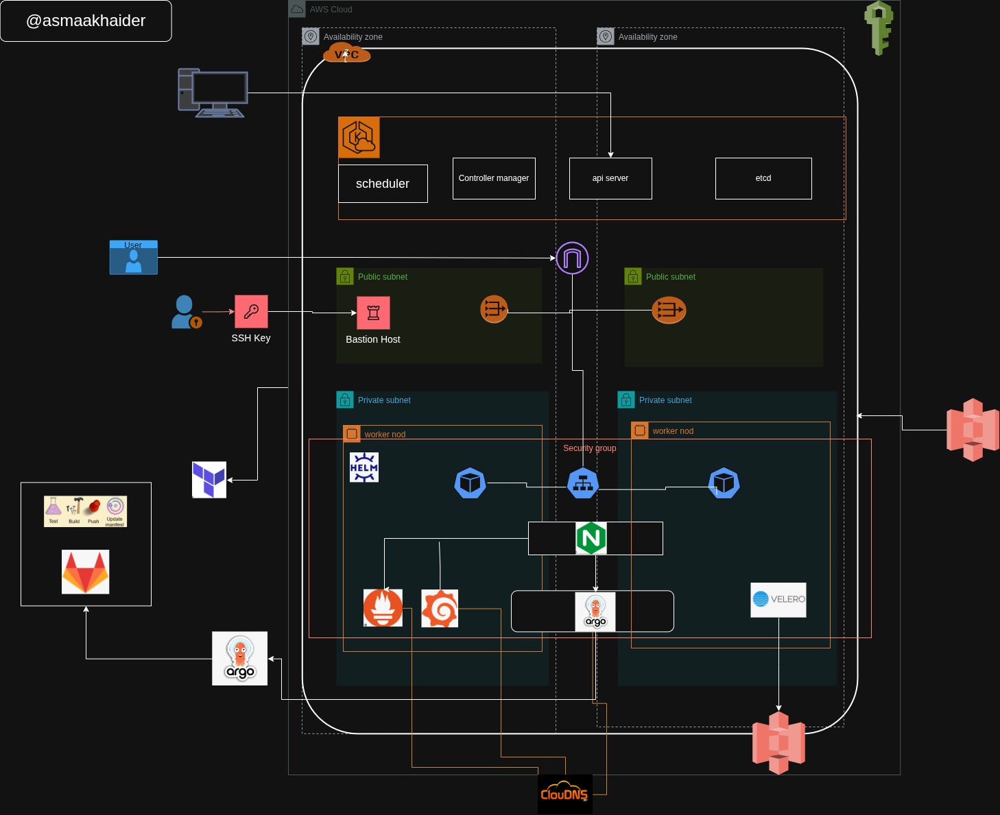

# Introduction


## Pourquoi intégrer un outil GitOps comme ArgoCD si l’on utilise déjà GitLab CI/CD pour le déploiement 



Dans mon projet DevOps, j’ai mis en place une architecture où :

Toute l’infrastructure AWS (VPC, EKS, RDS, etc.) est définie avec Terraform, stockée dans GitLab, puis déployée via les commandes terraform exécutées manuellement ou par pipeline.

 Les microservices sont buildés, scannés avec Trivy et poussés dans le GitLab Container Registry grâce à des pipelines GitLab CI.

 Les fichiers Kubernetes (YAML) de déploiement sont également stockés dans GitLab et mis à jour automatiquement par le pipeline (ex : nouveau tag d’image).
Git est déjà la source de vérité pour mon code, mon infra et mes manifests Kubernetes.

## Alors, pourquoi utiliser ArgoCD ?
Même si GitLab CI met à jour les manifests, ce n’est pas lui qui applique directement dans Kubernetes.
Avec ArgoCD, j’ai ajouté une couche GitOps qui permet :

 Une synchronisation automatique entre le dépôt Git et l’état du cluster

Une visualisation claire des ressources déployées (pods, services, applications…)

Un meilleur contrôle de la sécurité : personne ne déploie manuellement dans le cluster


# Prérequis
## Cloner ce dépôt
```bash

git clone git@gitlab.com:eks-argocd-gitops-terraform/terraform-cod-iac.git

```
## Structure du Projet
```bash
..
├── modules/
│   ├── networking/
│   ├── eks/
│   ├── bastion/
│   ├── argocd/
│   ├── ingress/
│   ├── rds/
│   ├── velero/
│   └── prometheus-grafana/
├── main.tf
├── provider.tf
├── variables.tf
├── outputs.tf
└── README.md

```
## Installer Terraform et AWS CLI :


```bash
# Installer Terraform
sudo apt install wget -y
wget -O- https://apt.releases.hashicorp.com/gpg | sudo gpg --dearmor -o /usr/share/keyrings/hashicorp-archive-keyring.gpg
echo "deb [signed-by=/usr/share/keyrings/hashicorp-archive-keyring.gpg] https://apt.releases.hashicorp.com $(lsb_release -cs) main" | sudo tee /etc/apt/sources.list.d/hashicorp.list
sudo apt update && sudo apt install terraform

# Installer AWS CLI
curl "https://awscli.amazonaws.com/awscli-exe-linux-x86_64.zip" -o "awscliv2.zip"
sudo apt-get install unzip -y
unzip awscliv2.zip
sudo ./aws/install

# Configurer AWS CLI
aws configure 
```


### entrer les informations suivantes :

AWS Access Key ID : clé IAM générée depuis la console AWS
AWS Secret Access Key : clé secrète associée à la clé IAM
Default region name : eu-west-3
Default output format : json

### Exécuter les commandes Terraform :

```bash
terraform init
terraform plan
terraform apply -auto-approve
```
## Vérification de l'installation d'ArgoCD depuis le Bastion
``` bash
kubectl get pods -n argocd
kubectl get services -n argocd
```
##  Installation de la CLI ArgoCD (depuis Bastion)
```bash
# Téléchargement du binaire ArgoCD
curl -sSL -o argocd-linux-amd64 https://github.com/argoproj/argo-cd/releases/latest/download/argocd-linux-amd64

# Rendre le binaire exécutable
chmod +x argocd-linux-amd64

# Déplacer le binaire dans un répertoire du PATH
sudo mv argocd-linux-amd64 /usr/local/bin/argocd

# Vérification de l'installation
argocd version
```
## Récuperer le password  et Accès ArgoCD 
```bash

URL : https://argocd.khaider.asmaa.cloudns.ch
kubectl get secret argocd-initial-admin-secret -n argocd -o jsonpath="{.data.password}" | base64 --decode
```
## Accéder à Prometheus / Grafana

```bash
  Prometheus : https://prometheus.khaider.asmaa.cloudns.ch
  Grafana : https://grafana.khaider.asmaa.cloudns.ch
  ```


##  Installation de la CLI velero (depuis Bastion)

```bash
curl -L https://github.com/vmware-tanzu/velero/releases/latest/download/velero-linux-amd64.tar.gz -o velero.tar.gz
tar -xvf velero.tar.gz
sudo mv velero /usr/local/bin/
```

## Supprimer l’infrastructure
```bash
terraform destroy -auto-approve
```
